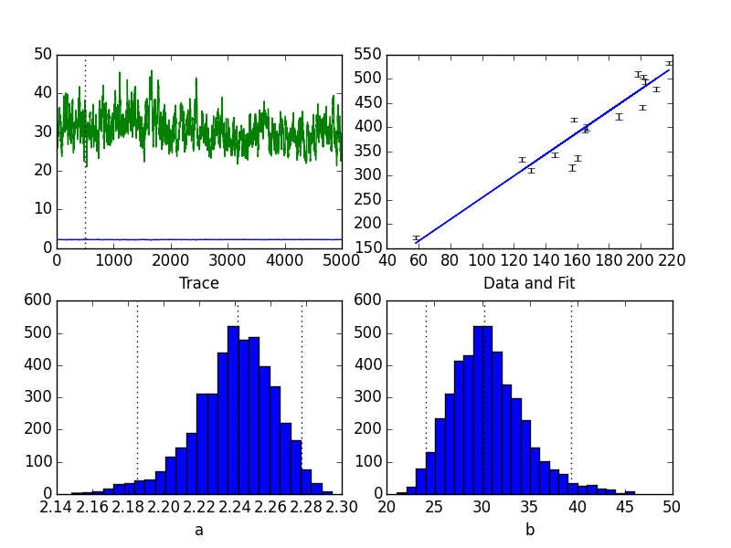

Multi Language MCMC Speed Test
==============================

Introduction
------------

This repo started as a speed comparision between Python, C++ and Go doing a simple MCMC linear regression.
It's turned into something of a rosetta stone for myself when learning new languages doing numerical computation.

Useful in Bayesian Inference, MCMC attempts to intelligently walk through parameter space to build probability distributions of the solution.
MCMC accomplishes this by creating a numerical chain of accepted randomly drawn numbers, each link dependent on the previous step.

The image below shows a 5000 element trace of this problem.
The top left pane shows the parameter walk through the steps and the top right pane is data with fitted line.
The two bottom panes show the probability distributions for the parameters with the 95% credible interval on either side of the median value.

I wrote a very simple MCMC program in a variety of languages each in a similar fashion while taking advantage of any language specific features that might make my life easier.
I'm using standard libraries.
Each program attempts to fit a line (y = ax + b) to a data set (x, y, dy) by creating a 500000 element trace for each parameter (a, b).
I've massaged the data and starting distributions enough to get a ~25% acceptance ratio which means each program will need to do ~2 million iterations.

Yes I am comparing the execution speeds of programs that aren't doing the same number of iterations.
They are however, preforming the same task which I, and possibly others, would find more useful than simply calculating a Fibonacci sequence or saying hello.
Not scientifically accurate, just anecdotally interesting.

Results
-------

| Language | Version | Total Iterations | Acceptance Ratio | Total CPU time (s) | Time/Iteration (ms) |
|:---:|:---:|:---:|:---:|:---:|:---:|
| Julia | 0.5 | 1910122 | 26.2% | 1.6 | 0.8 |
| Go | 1.4.2 | 1911726 | 26.2% | 2.3 | 1.2 |
| C++ | GCC 4.9.2 | 1841681 | 27.2% | 2.4 | 1.3 |
| Scala | 2.12.1 | 1910624 | 26.2% | 3.1 | 1.6 |
| PyPy | 5.6.0 | 1912917 | 26.2% | 5.3 | 2.8 |
| PyPy3 | 5.5.0-alpha | 1910852 | 26.2% | 7.5 | 3.9 |
| Python | 2.7.12 | 1913389 | 26.1% | 25.1 | 13.1 |
| Python3 | 3.5.2 | 1914281 | 26.1% | 28.0 | 14.6 |

Notes
-----

* All run on a standard 2012 retina MacBook Pro
* Python[2|3] and PyPy[2|3] all run using `mcmc.py`
